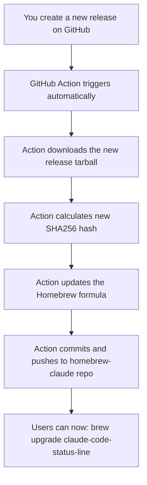

# 🤖 Homebrew Automation Setup

This document explains how to set up automatic Homebrew formula updates when you create new releases.

## 🔧 One-Time Setup

### 1. Create GitHub Personal Access Token

1. Go to GitHub Settings > Developer settings > Personal access tokens > Tokens (classic)
2. Click "Generate new token (classic)"
3. Name it: `Homebrew Formula Updates`
4. Select scopes:
   - ✅ `public_repo` (to update the homebrew-claude repository)
5. Copy the token (you'll only see it once!)

### 2. Add Token to Repository Secrets

1. Go to your `claude-code-status-line` repository
2. Settings > Secrets and variables > Actions
3. Click "New repository secret"
4. Name: `HOMEBREW_GITHUB_TOKEN`
5. Value: Paste your token from step 1
6. Click "Add secret"

## 🚀 How It Works

Once set up, the automation works like this:

## 📋 Your New Workflow

### Before (Manual):
1. Create release in main repo
2. Calculate SHA256 manually
3. Edit homebrew formula manually  
4. Commit and push homebrew repo manually

### After (Automated):
1. Create release in main repo ✅ **Done!**

The automation handles steps 2-4 automatically!

## 🧪 Testing the Automation

1. Make a small change to your status line script
2. Create a new release (e.g., v1.3.3) with a tag
3. Watch the Actions tab - you should see "Update Homebrew Formula" running
4. Check your homebrew-claude repo - it should have a new commit updating the version

## 🔍 If Something Goes Wrong

- Check the Actions tab in your main repository for error logs
- Verify your `HOMEBREW_GITHUB_TOKEN` secret is set correctly
- Ensure the token has `public_repo` permissions

## 📈 Benefits

- ✅ **No more manual updates** to homebrew formula
- ✅ **Immediate availability** - users get updates as soon as you release
- ✅ **No version mismatch** - formula always matches your releases
- ✅ **Professional workflow** - like major open source projects